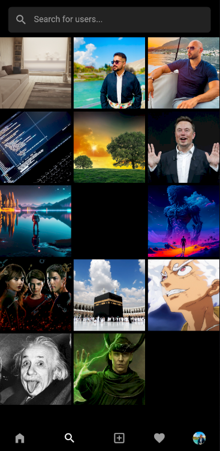

# Instagram Clone

Instagram Clone is a Flutter & Firebase project designed to emulate key features of the Instagram app, It follows the MVC+S (Model-View-Controller + Services) architecture and uses Riverpod for state management

## Description

InstagramClone is a mobile application that replicates some features of Instagram, allowing users to post photos, follow other users, view stories, and interact with the content, It is developed using Flutter for the frontend and Firebase for backend and uses Riverpod for state management

## Table of Contents

- [Screenshots](#screenshots)
- [Installation](#installation)
- [Features](#features)
- [Up-Coming Features](#up-coming-features)
- [Folder Structure](#folder-structure)
- [Libraries Used](#libraries-used)
- [Conclusion](#conclusion)

## Screenshots

|  |  |
| :----------------------: | :----------------------: |
|  |  |

|  |  |
| :----------------------: | :----------------------: |
|  |  |

* [Watch the video](https://drive.google.com/file/d/1nlejdWd7NQZDFqoDeqKziFZ9up2Ks-Lz/view?usp=drive_link)

## Installation

To run the app locally, follow these steps:

**Step 1:**

Download or clone this repo by using the link below:

```
https://github.com/Shadyar-Bzhar-Othman/instagram-clone-flutter.git
```

**Step 2:**

Go to project root and execute the following command in console to get the required dependencies:

```
flutter pub get
```

**Step 3:**

Set up Firebase:

- Create a new Firebase project on the [Firebase Console](https://console.firebase.google.com/u/0/)
- Enable Firebase Authentication, along with the Email/Password Authentication
- Enable Cloud Firestore
- Enable Firebase Storage
- Configure your Flutter app with the Firebase project by following the instructions in the [official documentation](https://firebase.flutter.dev/docs/overview/)

**Step 4:**

Run the app:

```
flutter run
```

## Features

### Authentication:

- User registration with email and password
- User login and logout

### Post Management:

- Create new posts with images and captions
- Like and unlike posts with heart animation
- Save posts
- Delete user's own posts

### Story Management:

- Add new story with image
- View stories of users you follow
- Delete user's own stories

### Comment Management:

- Add new comment
- Like and unlike comments
- Delete user's own comments

### User Interaction:

- Follow and unfollow other users
- Search for users by username
- Update user profile information
- View saved posts

### Dependency Injection:

- Use of the GetIt package for efficient dependency injection

## Up Coming Features

- User Notifications
- Logging
- Unit Testing

## Folder Structure

Here is the folder structure I have been using in this project:

```
📂lib/
|- 📂core/
    |- 📂controllers/
    |- 📂models/
    |- 📂providers/
    |- 📂services/
    |- dependency_injection.dart
|- 📂ui/
    |- 📂pages/
    |- 📂shared/
        |- 📂dialogs/
        |- 📂pages/
        |- 📂widgets/
|- 📂utils/
    |- assets.dart
    |- colors.dart
    |- consts.dart
    |- enums.dart
    |- helpers.dart
    |- routes.dart
    |- styles.dart
    |- theme.dart
    |- validators.dart
|- main.dart
```

Now, lets dive into the lib folder which has the main code for the application:

```
1- 📂core - Contains all models, controllers, services and providers with the dependency injection
2- 📂ui — Contains all the pages of the application and reusable widgets with dialogs and snackbars
3- 📂utils — Contains the utilities of the application
4- main.dart - This is the starting point of the application, All the application level configurations are defined in this file
```

### Core

This directory contains all models, controllers, services and providers with the dependency injection:

```
📂core/
    |- 📂controllers/
        |- post_controller.dart/
    |- 📂models/
        |- post_model.dart/
    |- 📂providers/
        |- post_provider.dart/
    |- 📂services/
        |- post_service.dart/
    |- dependency_injection.dart
```

### ui

This directory contains all the pages of the application and reusable widgets with dialogs and snackbars:

```
📂ui/
    |- 📂pages/
        |- feed_page.dart
    |- 📂shared/
        |- 📂dialogs/
            |- dialogs.dart
        |- 📂pages/
            |- no_internet_connection_page.dart
        |- 📂widgets/
            |- post_card.dart
            |- story_circle.dart
```

### utils

This directory contains the utilities of the application:

```
📂utils/
    |- assets.dart (all assets of the application)
    |- colors.dart (all colors of the application)
    |- consts.dart (all constants of the application)
    |- enums.dart (different type of enums of the application)
    |- helpers.dart (helper functions of the application)
    |- routes.dart (routes of the application)
    |- styles.dart (all custom and fixed styles of the application)
    |- theme.dart (theme of the application)
    |- validators.dart (validators of the application)
```

### main

This is the starting point of the application. All the application level configurations are defined in this file:

```
import 'package:firebase_auth/firebase_auth.dart';
import 'package:firebase_core/firebase_core.dart';
import 'package:flutter/material.dart';
import 'package:flutter_riverpod/flutter_riverpod.dart';
import 'package:instagramclone/core/dependency_injection.dart';
import 'package:instagramclone/firebase_options.dart';
import 'package:instagramclone/ui/pages/home_page.dart';
import 'package:instagramclone/ui/pages/login_page.dart';
import 'package:instagramclone/ui/shared/pages/loading_page.dart';
import 'package:instagramclone/utils/theme.dart';

void main() async {
  WidgetsFlutterBinding.ensureInitialized();
  await Firebase.initializeApp(
    options: DefaultFirebaseOptions.currentPlatform,
  );
  setupLocator();
  runApp(const ProviderScope(child: InstagramClone()));
}

class InstagramClone extends ConsumerWidget {
  const InstagramClone({super.key});

  @override
  Widget build(BuildContext context, WidgetRef ref) {
    return MaterialApp(
      title: 'Instagram Clone',
      debugShowCheckedModeBanner: false,
      theme: appTheme(),
      home: StreamBuilder<User?>(
        stream: FirebaseAuth.instance.authStateChanges(),
        builder: (context, snapshot) {
          if (snapshot.connectionState == ConnectionState.waiting) {
            return const LoadingPage();
          }

          if (snapshot.hasError) {
            return const Center(
              child: Text(
                  'Failed to load the app, Check your internet connection'),
            );
          }

          if (snapshot.hasData) {
            return const HomePage();
          }

          return const LoginPage();
        },
      ),
    );
  }
}

```

## Libraries Used

- [Firebase Core](https://pub.dev/packages/firebase_core)
- [Firebase Auth](https://pub.dev/packages/firebase_auth)
- [Cloud Firestore](https://pub.dev/packages/cloud_firestore)
- [Firebase Storage](https://pub.dev/packages/firebase_storage)
- [Flutter Riverpod](https://pub.dev/packages/flutter_riverpod) (State Management)
- [GetIt](https://pub.dev/packages/get_it) (Dependency Injection)
- [Flutter SVG](https://pub.dev/packages/flutter_svg)
- [Image Picker](https://pub.dev/packages/image_picker)
- [Font Awesome Flutter](https://pub.dev/packages/font_awesome_flutter)
- [Percent Indicator](https://pub.dev/packages/percent_indicator)
- [Uuid](https://pub.dev/packages/uuid)
- [Intl](https://pub.dev/packages/intl)

## Conclusion

I will be happy to answer any questions that you may have on this project, and if you want to lend a hand with the instagram clone project then please feel free to submit an issue and/or pull request 🙂

If you liked my work, don’t forget to ⭐ star the repo to show your support.
